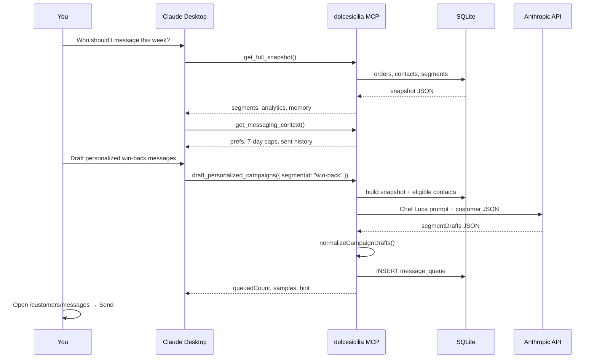

# Claude ↔ Dolce Sicilia — How messaging works

This document explains **exactly** how Claude reads your live customer data, writes personalized WhatsApp messages in Chef Luca’s voice, and how those messages land in the **Messages** page ready to send.

There are **three drafting routes** into the queue. **Route (c) is primary** — Claude composes in Desktop/Cowork with project skills and queues via MCP. Routes **(a)** and **(b)** are **fallbacks** (server `generateCampaignDrafts()` + `lucaVoice.ts`). The **Messages** page is a **display-and-send** surface over `message_queue` — it does not re-compose queued bodies.

---

## 1. The big picture (wireframe)

```
┌─────────────────────────────────────────────────────────────────────────────┐
│                         YOUR MAC (always on)                                │
│                                                                             │
│  ┌──────────────┐    ┌─────────────────┐    ┌──────────────────────────┐   │
│  │ Grab OCR +   │───▶│ SQLite DB       │◀───│ business-memory.md       │   │
│  │ Import page  │    │ contacts,       │    │ (learnings, daily brief) │   │
│  └──────────────┘    │ orders, logs,   │    └────────────┬─────────────┘   │
│                      │ message_queue   │                 │                 │
│                      └────────┬────────┘                 │                 │
│                               │                          │                 │
│         ┌─────────────────────┼──────────────────────────┘                 │
│         │                     │                                            │
│         ▼                     ▼                                            │
│  ┌─────────────────────────────────────────────────────────────────────┐   │
│  │              SHARED BRAIN (server/src/)                            │   │
│  │  buildBusinessSnapshot()  ·  computeCustomerSegments()               │   │
│  │  buildMessagingContext()  ·  normalizeCampaignDrafts()             │   │
│  │  generateCampaignDrafts() ·  lucaVoice guide (shared/lucaVoice)    │   │
│  └──────────────────────────────┬──────────────────────────────────────┘   │
│                                 │                                          │
│         ┌───────────────────────┼───────────────────────┐                  │
│         ▼                       ▼                       ▼                  │
│  ┌─────────────────┐  ┌─────────────────────┐  ┌──────────────────────┐  │
│  │ ROUTE (c) ★     │  │ ROUTE (a) fallback  │  │ ROUTE (b) fallback   │  │
│  │ MCP manual queue│  │ Website button      │  │ MCP auto-draft       │  │
│  │ queue_personalized_│  │ Other options →   │  │ draft_personalized_  │  │
│  │   messages      │  │ POST /api/ai/       │  │   campaigns          │  │
│  │ SKILL-POWERED ✓ │  │   draft-messages    │  │ (same as a)          │  │
│  └────────┬────────┘  └──────────┬──────────┘  └──────────┬───────────┘  │
│           │                       │                        │              │
│           │ Claude Desktop chat   └──────────┬─────────────┘              │
│           │ writes copy with skills         ▼                            │
│           │                      ┌────────────────────────┐                │
│           │                      │ Anthropic API (a + b)  │                │
│           │                      │ lucaVoice.ts — NOT     │                │
│           │                      │ Desktop skills         │                │
│           │                      └────────────┬───────────┘                │
│           └──────────────────────────────────┼────────────────────────────┘
│                                              ▼
│                    ┌────────────────────────┐
│                    │ message_queue table    │
│                    │ (pending, per-contact) │
│                    └────────────┬───────────┘
│                                 ▼
│   ┌─────────────────────────────────────────────────────────────────┐
│   │ MESSAGES PAGE — display + manual send only                        │
│   │  WHO (filter) │ WHAT (read-only queue) │ SEND (OpenWA)           │
│   │  Loads message_queue on open — never re-drafts queued bodies      │
│   └─────────────────────────────────────────────────────────────────┘
└─────────────────────────────────────────────────────────────────────────────┘
```

---

## 2. Three drafting routes

| Route | Trigger | Who writes the copy | Skill-powered? | Role |
|-------|---------|---------------------|----------------|------|
| **(c) MCP manual queue** ★ | Scheduled task or chat → `queue_personalized_messages` (per contact) or `queue_custom_message` | **Claude Desktop / Cowork project skills** — copy written in chat, then pushed to DB | **Yes** | **Primary** |
| **(a) Website button** | Messages → **Other options** → Server draft → `POST /api/ai/draft-messages` | Server `generateCampaignDrafts()` + `lucaVoice.ts` | **No** | Fallback |
| **(b) MCP auto-draft** | MCP tool `draft_personalized_campaigns` | **Same as (a)** | **No** | Fallback |

> **Primary path:** Claude reads live data via MCP (`get_business_memory`, `get_full_snapshot`, `get_customer_segments`, `get_messaging_context`), composes 1-to-1 messages with project skills, then `queue_personalized_messages` with optional `templateId` (e.g. `claude:win-back`) and `templateName: "Composed by Claude"`.

> **To get skill-quality copy:** have Claude write the messages in chat and push them via `queue_personalized_messages` — the auto-draft tool (`draft_personalized_campaigns` and the website **Ask Claude** button) does **not** use your project skills.

Routes **(a)** and **(b)** produce **identical message quality** because they call the same `generateCampaignDrafts()` function in `server/src/campaignDraftAgent.js`. Neither path talks to your Claude Desktop session; both call the Anthropic API directly on your Mac with the codified voice guide only.

Route **(c)** never calls `generateCampaignDrafts()`. Claude composes the text in your project (skills apply), then MCP writes the bodies you approved into `message_queue`.

---

## 3. Data exchange — what Claude actually receives

### Step 1: Live data is read from SQLite

```javascript
// Same in MCP and API:
orders     = listAllOrders()
contacts   = listContactsWithMessages()  // includes send history, prefs
campaignResults = listCampaignResults()
```

### Step 2: `buildBusinessSnapshot()` packages it

Claude never sees raw SQL. It gets a JSON snapshot:

| Block | Contents |
|-------|----------|
| `orderAnalytics` | Revenue, AOV, repeat rate, peak hours, top customers |
| `segments[]` | win-back, high-value-first, vip, tray-upsell, top-spender, new-nurture — each with **contact list** |
| `promoCampaigns[]` | ORANGE, TREAT, TRAY, VIP keywords (reference only — **not** copy-paste templates) |
| `messaging.contacts[]` | Per contact: `messagePref`, `lastMessageSentAt`, `recentlyMessaged`, `sentTemplateIds` |
| `campaignFeedback` | Survey scores, completion rate |
| `businessMemory` | Learnings from `server/data/business-memory.md` |

### Step 3: Eligibility filter (before Claude writes)

Only contacts who **can** receive a message are included in the prompt:

- Not messaged in the last **7 days**
- Not `opt_out`
- Real contact ID from the segment list

This prevents Claude from drafting for people you cannot send to.

### Step 4: The prompt Claude gets

```
┌─────────────────────────────────────────┐
│ CHEF LUCA VOICE GUIDE (shared/lucaVoice)│
│ — forbidden boilerplate phrases         │
│ — good examples with {{firstName}}      │
├─────────────────────────────────────────┤
│ BUSINESS MEMORY (markdown learnings)    │
├─────────────────────────────────────────┤
│ SEGMENTS & ELIGIBLE CONTACTS (JSON)     │
│  segmentId, name, who, promoKeyword     │
│  contacts: [{ id, name, orderCount,      │
│    totalSpend, daysSinceOrder, ... }]   │
├─────────────────────────────────────────┤
│ INSTRUCTIONS: return JSON only          │
│  segmentDrafts[].messages[]             │
│  one unique body per contactId          │
└─────────────────────────────────────────┘
```

### Step 5: Claude returns JSON (not WhatsApp yet)

```json
{
  "summary": "Why these segments now",
  "segmentDrafts": [
    {
      "segmentId": "high-value-first",
      "campaignId": "high-value-first",
      "rationale": "3 first orders S$35–S$51 in last 9 days",
      "messages": [
        {
          "contactId": "1781694319720-dx1akvu",
          "body": "Ciao {{firstName}} 🌿 Your order today made my morning — S$51 tells me..."
        }
      ]
    }
  ]
}
```

---

## 4. Normalization — from Claude JSON to send-ready queue

Raw Claude output is **never** sent directly. It passes through `normalizeCampaignDrafts()`:

```
Claude JSON
    │
    ▼
┌───────────────────────────────────────┐
│ normalizeCampaignDrafts()             │
│ ✓ segmentId valid?                    │
│ ✓ contactId exists in DB?              │
│ ✓ contact actually in that segment?   │
│ ✓ body non-empty?                     │
│ ✓ normalizeMessageBody() → {{firstName}}│
│ ✓ not messaged in last 7 days?        │
│ ✓ checkMessageDuplicate()             │
└───────────────────────────────────────┘
    │
    ▼
┌───────────────────────────────────────┐
│ queueCustomMessages() → SQLite        │
│ message_queue (status: pending)       │
│ template_id: claude:high-value-first  │
│ template_name: Claude · High-value... │
└───────────────────────────────────────┘
    │
    ▼
┌───────────────────────────────────────┐
│ last_campaign_drafts setting          │
│ (metadata for What → Claude tab)      │
└───────────────────────────────────────┘
```

**Skipped contacts** are reported with reasons: `recent_message`, `duplicate_message`, `not_in_segment`, etc.

---

## 5. Messages page wireframe — where drafts appear

After drafting, open **Messages** (`/customers/messages`):

```
┌────────────────────────────────────────────────────────────────────────────┐
│ Messages                                                                   │
│ [WhatsApp connection ▼]  [Survey automation ▼]                             │
├──────────────────┬─────────────────────────────┬───────────────────────────┤
│ WHO              │ WHAT                        │ SEND                      │
│                  │                             │                           │
│ ● High-value     │ [Ask Claude for segment]    │ 3 ready · 3 variants      │
│   first order 3  │                             │                           │
│ ○ Win-back 2     │ Tabs:                       │ ┌─ alpana roy ─────────┐ │
│ ○ VIP 1          │ [Claude(3)] Static Templates│ │ Ciao alpana 🌿 S$51... │ │
│                  │                             │ └──────────────────────┘ │
│ Segment defs →   │ Claude drafts:              │ ┌─ Jolene Chea ────────┐ │
│                  │ ┌─ High-value first order ─┐│ │ Ciao Jolene 🍋 4d...  │ │
│                  │ │ rationale...             ││ └──────────────────────┘ │
│                  │ │ alpana: Ciao [Name] 🌿...││                           │
│                  │ │ Jolene: Ciao [Name] 🍋...││ [Send via OpenWA (3)]   │
│                  │ └──────────────────────────┘│                           │
└──────────────────┴─────────────────────────────┴───────────────────────────┘
```

### Column rules

| Column | Source | What you see |
|--------|--------|--------------|
| **Who** | `computeCustomerSegments()` | Segment list + counts. Pick audience. |
| **What → Claude** | `last_campaign_drafts` / API response `drafts[]` | Claude’s personalized text per customer |
| **What → Static promo** | `PROMO_CAMPAIGNS` in `shared/customerSegments` | Generic ORANGE/TREAT template — **not** Claude |
| **Send** | `message_queue` + `effectiveQueueItems` | **Must match Claude tab** — one variant per customer |

**Golden rule:** If **What → Claude** and **Send** show different text, that’s a bug. They must use the same queue bodies. **Static promo** is a separate, explicit tab.

---

## 6. MCP workflow — recommended conversation with Claude Desktop

### Setup (once)

```bash
./scripts/install-claude-mcp.sh
# Quit Claude Desktop fully (Cmd+Q), reopen
# Settings → Developer → MCP → dolcesicilia = connected
```

Open your **Dolce Sicilia Claude project** (skills, menu docs, tone) — skills apply to **route (c)** and strategy chat, not to `draft_personalized_campaigns`.

### Ideal tool sequence (route b — auto-draft, server lucaVoice)



### MCP tools cheat sheet

| Tool | When to use | Skill-powered copy? |
|------|-------------|---------------------|
| `get_full_snapshot` | Start any strategy chat — orders + segments + memory | — |
| `get_customer_segments` | Drill into one segment’s contact list | — |
| `get_messaging_context` | Before sending — who is eligible, who was messaged recently | — |
| `check_message_send` | Before manual queue — duplicate guard | — |
| **`draft_personalized_campaigns`** | Auto-draft 1-to-1 messages from live data (server `lucaVoice`) | **No** |
| **`queue_personalized_messages`** | **You wrote bodies in chat** — queue per contact | **Yes** |
| `queue_custom_message` | One shared body for all (you wrote it in chat) | **Yes** |
| `save_business_insight` | Teach the server something persistent for the next auto-draft | — |

### Example prompts (Claude Desktop)

**Auto-draft (route b — server lucaVoice, not your skills):**
> Call `get_full_snapshot`, then `draft_personalized_campaigns` for the highest-impact segment. Tell me who was skipped and why.

**One segment (route b):**
> `get_customer_segments` for `high-value-first`, check messaging context, then `draft_personalized_campaigns` with `segmentId: high-value-first`.

**Skill-powered draft (route c — primary):**
> Call `get_customer_segments` for `high-value-first` and `get_messaging_context`. Write a unique WhatsApp message in Chef Luca voice for each eligible contact, then `queue_personalized_messages` with `templateId: "claude:high-value-first"` and `templateName: "Composed by Claude"` per item.

**After queuing:**
> Open http://100.x.x.x:5173/customers/messages — pending rows load automatically. **What** shows read-only bodies from `message_queue`; **Send** is manual OpenWA only.

---

## 7. Website workflow — Messages page (display + send)

The hub at `/customers/messages` is **not** a composer. It:

1. **Loads** `GET /api/messages/queue` on open (all pending rows)
2. **Displays** `message_body` exactly as stored — only `{{firstName}}` is filled at preview/send
3. **Labels** source from `template_id` / `template_name` (e.g. “Composed by Claude” vs “Server draft (fallback)”)
4. **Sends** manually via OpenWA — dedup and 7-day cap unchanged

**Fallback (route a)** — under **Other options → Server draft (lucaVoice)**:

```
POST /api/ai/draft-messages
body: { segmentId?: "high-value-first", autoQueue: false }   ← preview only
        │
        ▼
generateCampaignDrafts()  ← does NOT touch message_queue
        │
        ▼
POST /api/ai/draft-messages/stage  ← explicit; skips contacts with pending rows
```

Static promo, templates, and custom messages are under **Other options** and never clear the queue.

### Queue durability (enforced server-side)

Pending rows in `message_queue` **cannot be bulk-deleted**. They are removed **only per customer after a successful send** (`sendAdHocMessage` clears that `contact_id`).

| Action | Queue effect |
|--------|----------------|
| `queue_personalized_messages` (MCP) | Inserts new rows; **skips** contacts who already have pending rows |
| `draft-messages` / `draft_personalized_campaigns` | Preview only (`autoQueue: false`) |
| `draft-messages/stage` | Stages only contacts **without** pending rows |
| `DELETE /api/messages/queue` without `contactIds` | **Rejected** (400) |
| `DELETE /api/messages/queue` with `contactIds` | Removes only those contacts (after send, or manual per-row remove) |
| UI Templates / segment picker | Display only — never deletes DB rows |

**Why the queue looked wiped before:** (1) old UI cleared local state when opening Templates; (2) old server `autoQueue` and `queueCustomMessages` deleted pending rows before re-insert; (3) optional “Clear queue” button; (4) MCP/website pointed at different `contacts.db` paths. Those paths are now blocked or fixed.

---

## 8. Chef Luca voice — skills vs server code

| Layer | Used by | What it does |
|-------|---------|--------------|
| **Your Claude Desktop / Cowork project skills** | **Route (c)** only — chat drafting before `queue_personalized_messages` | Chef persona, menu, Singapore context you configured in the project |
| **`shared/lucaVoice.ts`** | **Routes (a) and (b)** — `generateCampaignDrafts()` | Codified voice rules injected into the server-side Anthropic API prompt. Forbids static TREAT/ORANGE boilerplate. **Does not read Desktop skills.** |
| **`business-memory.md`** | Routes (a) and (b) auto-draft; readable in Desktop via MCP | Shared learnings (daily briefs, patterns) |
| **`save_business_insight` (MCP)** | Desktop → file on disk | Claude Desktop can **write** new learnings → next auto-draft (a/b) sees them |

To improve **auto-draft** quality (routes a/b):

1. Add insights via MCP `save_business_insight` or edit `server/data/business-memory.md`
2. Refine `shared/lucaVoice.ts` with phrases Luca actually uses

To improve **skill-powered** quality (route c): refine your Claude Desktop / Cowork project skills and instructions — that is the only drafting path that uses them.

---

## 9. What gets sent on WhatsApp

When you click **Send via OpenWA**:

1. UI sends `POST /api/messages/send-batch` with each contact’s **queued body**
2. Server runs `fillTemplate(body, customerName)` → `{{firstName}}` becomes `alpana`, `Jolene`, etc.
3. OpenWA delivers to each phone
4. `message_log` records template `claude:high-value-first` + exact body
5. Future drafts skip duplicates via `checkMessageDuplicate()`

---

## 10. Troubleshooting

| Symptom | Cause | Fix |
|---------|-------|-----|
| "Cannot reach server" | Mac API not running or old code | `./scripts/restart.sh` then hard refresh |
| What shows Claude, Send shows TREAT template | Queue wiped by segment click (fixed) | Hard refresh; Ask Claude again; use **Static promo** tab only if you want generic text |
| Claude drafts 0 people | Everyone messaged in 7 days or duplicate | Check `get_messaging_context` |
| Auto-draft doesn’t sound like my skills | Routes (a/b) use `lucaVoice.ts`, not Desktop skills | Use route (c): write in chat → `queue_personalized_messages` |
| MCP not connected | Claude Desktop not restarted | Cmd+Q, reopen, check Settings → MCP |

**Health check:**
```bash
curl http://127.0.0.1:3001/api/health
curl -X POST http://127.0.0.1:3001/api/ai/draft-messages -H 'Content-Type: application/json' -d '{}'
```

---

## 11. File map (for developers)

| File | Role |
|------|------|
| `server/mcp/index.js` | MCP tools exposed to Claude Desktop |
| `server/src/campaignDraftAgent.js` | Builds prompt, calls Anthropic API |
| `server/src/campaignDraftNormalize.js` | Validates + dedupes Claude JSON |
| `server/src/businessSnapshot.js` | Packages live data for Claude |
| `server/src/messagingContext.js` | Per-contact prefs + send history |
| `shared/lucaVoice.ts` | Chef Luca voice rules |
| `shared/customerSegments.ts` | Segment definitions + static promos |
| `app/src/pages/CustomerMessages.tsx` | WHO / WHAT / SEND UI |
| `server/data/business-memory.md` | Persistent learnings |

---

## 12. One-sentence summary

**Routes (a) and (b) call the same server `generateCampaignDrafts()` (Anthropic API + `lucaVoice.ts`); route (c) is the only skill-powered path (chat → `queue_personalized_messages`); normalization and dedup apply to all; the queue lands in Messages → Send; OpenWA delivers with each customer’s real first name.**

---

*See also: [claude-desktop-mcp-setup.md](./claude-desktop-mcp-setup.md) for install steps.*
